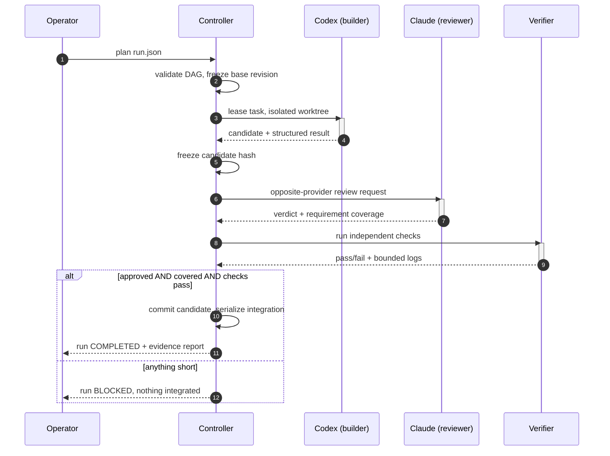
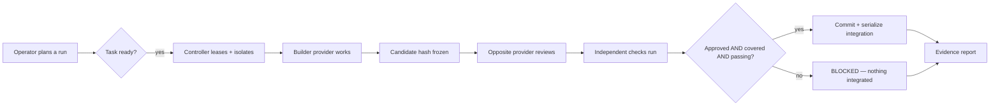

<div align="center">

# Stack Integration Engine


[](https://github.com/Senpai-Sama7/stack-integration-engine/actions/workflows/ci.yml)


[](https://github.com/Senpai-Sama7/stack-integration-engine/stargazers)

**Codex and Claude Code as one bounded engineering team — not two models you have to trust on faith.**

[Why this exists](#why-you-would-want-this) ·
[See it run](#see-it-run) ·
[Quick start](#quick-start) ·
[Command reference](#command-reference) ·
[Trust model](#the-trust-model-plainly) ·
[Docs](#documentation)

</div>

---

## Why you would want this

Run Codex or Claude alone and one model marks its own homework. Run them in two terminals by
hand and you get no shared state, no enforced review, no evidence trail, and a merge you have
to trust on vibes.

Stack Integration Engine is the missing layer in between — and it is opinionated about it:

<table>
<tr>
<td width="50%" valign="top">

**🔁 Opposite-provider review, enforced**
Codex's work is reviewed by Claude and vice versa — never by itself — bound to the exact
candidate hash it was written against.

**🚫 Fails closed, not open**
Earlier versions of this project quietly returned synthetic success. v0.2 doesn't: unavailable
capabilities, malformed output, missing tests, stale leases, and unknown steps all surface as
visible failures instead of green checkmarks.

**🌳 Isolated by construction**
Every modifying task runs in its own Git worktree. Nothing touches your working tree until it
has passed review, requirement coverage, and independent checks.

</td>
<td width="50%" valign="top">

**📜 Evidence, not narrative**
Every claim of "done" is backed by a stored artifact, a review tied to a candidate hash, and a
check log the controller ran itself — not a model's summary of what it did.

**🔒 Local-first, credential-free**
No API keys handled or stored. It rides your existing `codex` and `claude` CLI logins and never
leaves your machine unless you tell it to.

**🧑‍✈️ You're still the operator**
Push, deploy, delete, and privilege changes are denied by default and require you explicitly,
every time.

</td>
</tr>
</table>

> If you've ever asked an AI coding agent "are you sure?" and gotten a confident answer you
> couldn't verify — this is the tool that makes verification structural instead of hopeful.

---

## See it run

One task, start to finish — plan, dispatch, cross-review, verify, integrate:



Same flow, structurally:



The controller owns task assignment, state, grants, and integration. Providers own reasoning
and bounded work products — never authority. Full detail: [Architecture](docs/ARCHITECTURE.md).

---

## Quick start

**Requirements:** Python 3.11+, Git, and at least one supported provider CLI. For two-team
operation, both `codex` and `claude` must already be authenticated through their normal login
flows — this tool never asks for or stores credentials itself.

```bash
python3 -m venv .venv
.venv/bin/pip install -e '.[dev,api]'
.venv/bin/stack-agent doctor --project .
```

`doctor` probes provider auth, NEXUS, and SDLC support and reports capability status without
ever touching account email, org IDs, or tokens.

<details>
<summary><b>▶ Run your first two-provider review</b> — click to expand</summary>

```bash
.venv/bin/stack-agent plan examples/local-review.json --project .
```

This prints a run ID. Execute it and inspect the result:

```bash
.venv/bin/stack-agent run RUN_ID
.venv/bin/stack-agent status RUN_ID
.venv/bin/stack-agent report RUN_ID --output run-report.json
```

For a task that actually modifies files, set `side_effect` to `worktree_write` and constrain
`allowed_paths` in your task spec. A confident narrative from the worker isn't enough to pass:
you need a changed candidate, an opposite-provider approval, full requirement coverage, and
passing independent checks — all four, every time.

</details>

<details>
<summary><b>🐳 Prefer a container?</b> — click to expand</summary>

The container runs only the controller's status API — host CLI authentication is deliberately
never copied into the image.

```bash
docker compose up --build
docker compose exec orchestrator sh -c 'cat /var/lib/stack-agent/operator.token'
```

The host publishes only `127.0.0.1:8765`. Run actual model work through the host CLI unless
you've built and independently reviewed your own credential/socket forwarding boundary.

</details>

---

## Command reference

<details open>
<summary><b>Operator commands</b></summary>

```text
doctor                     probe providers, authentication, NEXUS, and SDLC
project add PATH           register a Git repository without modifying it
plan SPEC --project PATH   validate and persist a run/task DAG
run RUN_ID                 execute, cross-review, verify, and integrate
status RUN_ID              show authoritative task states
inspect KIND ID            inspect a versioned record
steer RUN_ID TEXT          add an operator instruction to subsequent context
pause/resume/cancel        control new dispatch
report RUN_ID              export evidence and explicit limitations
backup DESTINATION         create a consistent SQLite backup
schemas DIRECTORY          generate contract JSON Schemas
serve                      run the token-protected loopback dashboard/API
issue-grant                create a short-lived signed MCP bridge token
```

State defaults to `~/.local/state/stack-agent` — override with `--state` or
`STACK_AGENT_STATE`. The dashboard defaults to `127.0.0.1:8765`; remote listeners are rejected
by local policy, full stop.

</details>

---

## The trust model, plainly

```mermaid
flowchart TB
    subgraph Denied by default
        Push[Push]
        Deploy[Deploy]
        Delete[Delete]
        Priv[Privilege changes]
    end
    Op[Operator] -- explicit, per-action grant only --> Denied by default
    Ctl[Controller] -- sole DB writer + authority source --> State[(SQLite WAL)]
    Cx[Codex session] -- untrusted text --> Ctl
    Cl[Claude session] -- untrusted text --> Ctl
    Ctl -- signed, expiring grant --> Cx
    Ctl -- signed, expiring grant --> Cl
    Cx -. peer message: evidence only, never authority .-> Cl
```

- The controller is the **only** database writer and authority source. Everything a provider
  says is untrusted text until the controller verifies it.
- A reviewer can never approve its own provider's work — review and check are always bound to
  one exact candidate hash and go stale the moment that candidate changes.
- Peer messages between providers can never grant push, deploy, delete, privilege, policy, or
  scope authority — messages are evidence, not permission.
- Git worktrees prevent accidental overlap between tasks, but they are **not** a security
  sandbox — provider-native permission controls stay on regardless.
- Push, deploy, destructive operations, and credential changes sit outside the default grant
  set. You opt in explicitly, per action.

Read the full threat model: [docs/SECURITY.md](docs/SECURITY.md).

---

## Documentation

| Doc | What's in it |
|---|---|
| [Architecture](docs/ARCHITECTURE.md) | Control flow, lifecycle, storage model |
| [Operator guide](docs/OPERATOR_GUIDE.md) | Day-to-day operation, walk-throughs |
| [Contracts and state machine](docs/CONTRACTS.md) | Every record type and legal transition |
| [Security and threat model](docs/SECURITY.md) | What's trusted, what isn't, and why |
| [Recovery exercises](docs/RECOVERY.md) | What to do when something goes wrong |
| [Compatibility matrix](docs/COMPATIBILITY.md) | Supported provider CLI versions/flags |
| [Implementation status](docs/IMPLEMENTATION_PLAN.md) | What's built vs. planned |
| [Live provider probe](docs/evidence/live-provider-probe.json) | Real capability probe output |

---

## Verify it yourself

Don't take the pitch on faith — the whole point of this project is that you shouldn't have to.

```bash
.venv/bin/ruff check stack_integration tests
.venv/bin/ruff format --check stack_integration tests
.venv/bin/mypy stack_integration
.venv/bin/pytest --cov=stack_integration --cov-report=term-missing
```

The deterministic suite exercises every controller invariant without spending model quota.
Live-provider checks are kept separate because provider availability and subscription quota are
conditions outside this repo's control.

---

<div align="center">

### License

MIT — see [LICENSE](LICENSE).

<sub>Built for people who want two AI engineers working for them — not one AI engineer
grading its own test.</sub>

</div>
