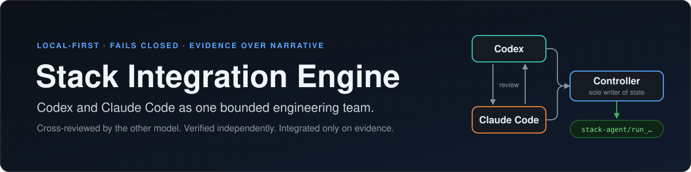
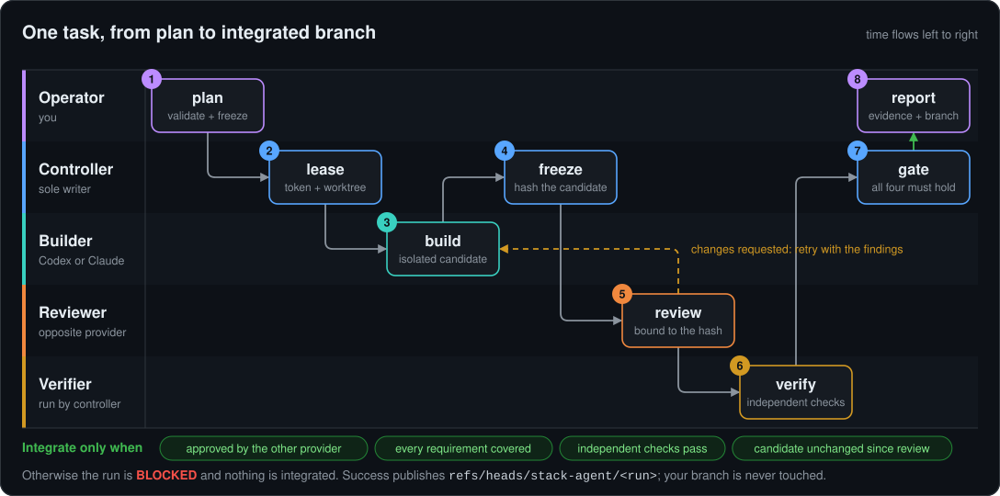
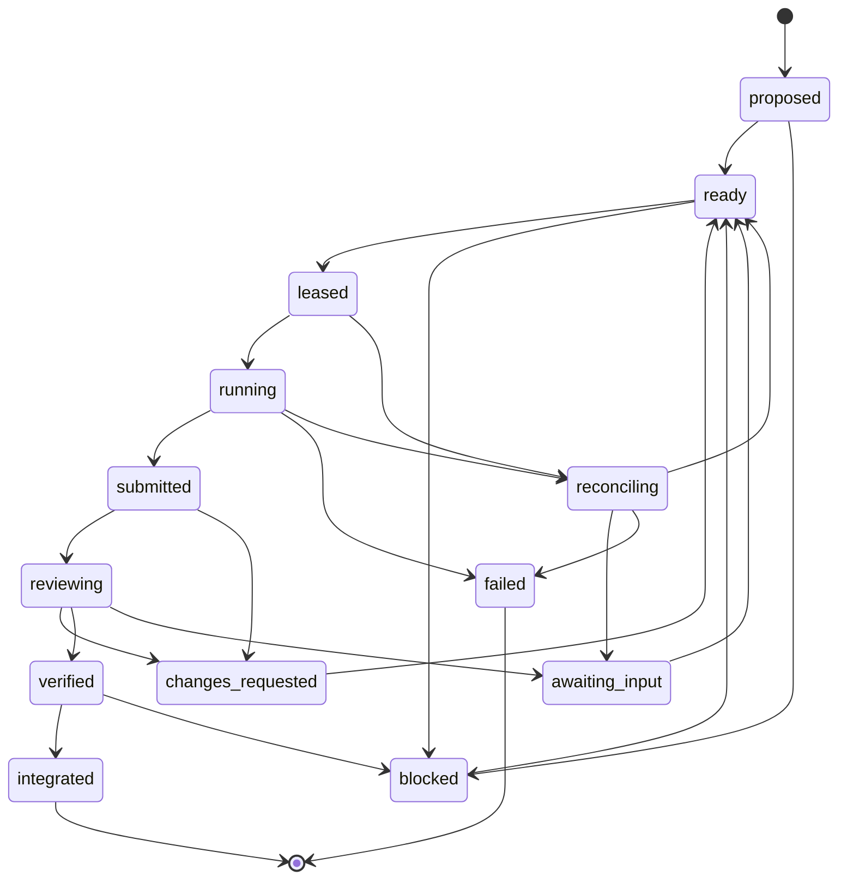
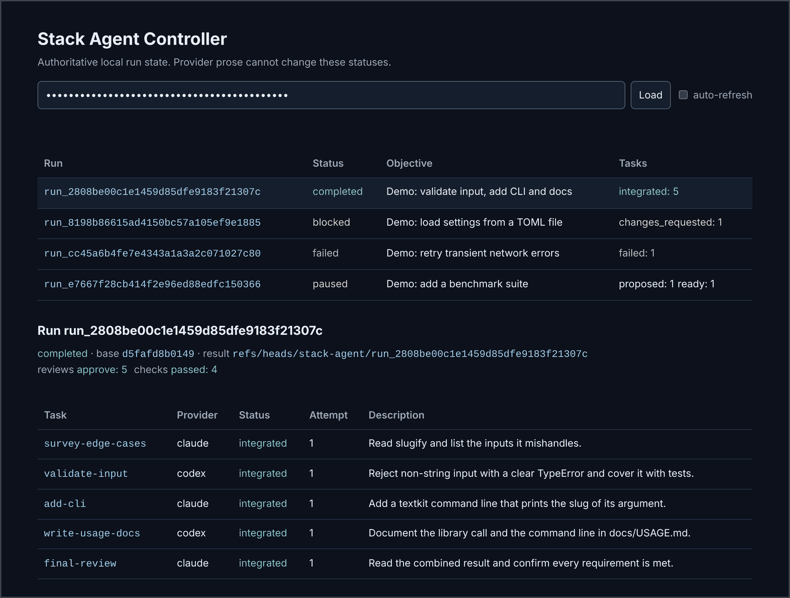
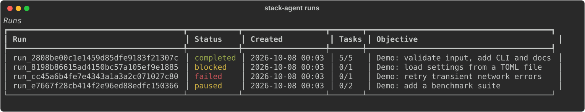
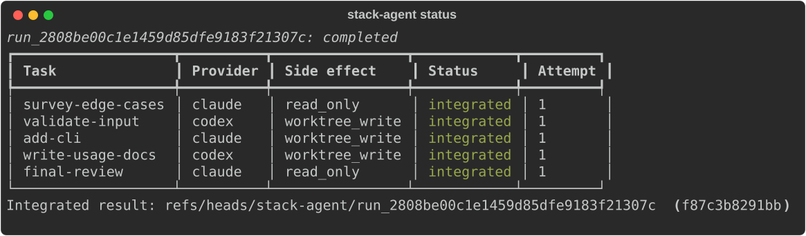

<p align="center">
  
</p>

<p align="center">
  <a href="https://github.com/Senpai-Sama7/stack-integration-engine/actions/workflows/ci.yml"></a>
  
  
  
  
</p>

<p align="center">
  <a href="#how-it-works">How it works</a> ·
  <a href="#see-it-work">See it work</a> ·
  <a href="#quick-start">Quick start</a> ·
  <a href="#command-reference">Commands</a> ·
  <a href="#trust-model">Trust model</a> ·
  <a href="#limits-you-should-know-about">Limits</a> ·
  <a href="#documentation">Docs</a>
</p>

---

Run one coding model alone and it grades its own homework. Run two by hand and you get no shared
state, no enforced review, and a merge you accept on faith.

**Stack Integration Engine is the layer in between.** A local controller hands tasks to Codex and
Claude Code, isolates each one in its own Git worktree, makes the *other* model review the result,
runs its own checks, and integrates only when every gate holds. Nothing is integrated because a
model said it was done. It is integrated because the evidence says so.

| Principle | In practice |
|---|---|
| **Opposite-provider review** | Codex work is reviewed by Claude and the reverse, never by the same provider. A review is bound to the exact candidate hash it saw. |
| **Isolated by construction** | Every modifying task runs in its own Git worktree with an allowed-path scope. Your checked-out branch is never touched. |
| **Evidence, not narrative** | "Done" means a stored artifact, a review tied to a candidate hash, and a check log the controller ran itself. |
| **Fails closed** | Missing tests, malformed output, stale leases, unavailable capabilities, and unknown fields all surface as visible failures, never as a green check. |
| **Local-first** | It rides your existing `codex` and `claude` CLI logins and never asks for or stores provider credentials. The dashboard listens on loopback only. |
| **You stay the operator** | Push, deploy, delete, and privilege changes are outside every worker grant. |

## How it works

<p align="center">
  
</p>

A task is integrated only when **all four** hold:

1. **Approved** by the opposite provider,
2. every acceptance requirement is **covered**,
3. the controller's independent **checks pass** (and tests actually ran), and
4. the candidate is **unchanged** since it was reviewed.

If any one fails, the run is `blocked` and nothing is integrated. On success the verified result is
published as the branch `stack-agent/RUN_ID`. Your checkout is never modified; review and merge that
branch like any other.

| Role | Does | Never does |
|---|---|---|
| **Operator** (you) | Plans runs, steers, retries, merges the result branch | Delegate push, deploy, or delete (worker grants exclude them) |
| **Controller** | Sole writer of state; leases tasks, builds worktrees, hashes candidates, runs checks, integrates | Treat provider prose as fact |
| **Builder** (Codex or Claude) | Works inside a worktree and an allowed-path scope, returns structured output | Write state, widen its scope, push |
| **Reviewer** (the other provider) | Reviews the exact candidate; returns a verdict and requirement coverage | Approve its own provider's work |
| **Verifier** | Runs checks as controller-owned subprocesses with bounded, redacted logs | Pass a task when no tests ran |

Independent tasks run in parallel and dependents start the moment their prerequisites verify.
Integration is serialized and cherry-picks in dependency order. Every task holds a fenced,
heartbeat-renewed lease: if a writer goes quiet it loses the lease, and its task waits for you in
`reconciling` instead of being silently re-run.

<details>
<summary><b>Task lifecycle</b> (every legal transition, from <code>stack_integration/contracts/models.py</code>)</summary>


```mermaid
stateDiagram-v2
    [*] --> proposed
    proposed --> ready
    proposed --> blocked
    ready --> leased
    ready --> blocked
    leased --> running
    leased --> reconciling
    running --> submitted
    running --> failed
    running --> reconciling
    submitted --> reviewing
    submitted --> changes_requested
    reviewing --> changes_requested
    reviewing --> verified
    reviewing --> awaiting_input
    changes_requested --> ready
    verified --> integrated
    verified --> blocked
    reconciling --> ready
    reconciling --> awaiting_input
    reconciling --> failed
    blocked --> ready
    awaiting_input --> ready
    integrated --> [*]
    failed --> [*]
```

`cancelled` is a terminal state reachable from `proposed`, `ready`, `leased`, `running`,
`changes_requested`, `blocked`, and `awaiting_input`. Any other transition raises. A test keeps this
diagram identical to the code.

</details>

## See it work

These captures are real output of the real controller, produced by
[`examples/seed_demo.py`](examples/seed_demo.py). The providers in that script are deterministic
simulators, so no model is called and no quota is spent, and every demo objective is prefixed
`Demo:` so it can never be mistaken for evidence about real work. The seeded state has four runs
that end four different ways.

<p align="center">
  
</p>

<p align="center">
  
</p>

<p align="center">
  
</p>

The completed run surveyed the repository with Claude, then added input validation with Codex and a
command line with Claude (independent tasks), wrote the docs with Codex, and had every task reviewed
by the other provider. The blocked run is a
reviewer that kept asking for changes. The failed run tried to write outside its allowed paths.
Neither integrated anything.

<details>
<summary><b>Evidence report excerpt</b> (<code>stack-agent report RUN_ID</code>, abridged)</summary>

```json
{
  "summary": {
    "tasks": { "integrated": 5 },
    "reviews": { "approve": 5 },
    "checks": { "passed": 4 },
    "reported_cost_usd": null
  },
  "reviews": [
    {
      "task_id": "survey-edge-cases",
      "author_provider": "claude",
      "reviewer_provider": "codex",
      "candidate_hash": "21ac3104cb0f0a9a...",
      "requirement_coverage": ["REQ-VALIDATION"],
      "verdict": "approve"
    }
  ],
  "checks": [
    {
      "task_id": "add-cli",
      "definition_id": "pytest",
      "status": "passed",
      "exit_code": 0,
      "tests_collected": 4,
      "candidate_hash": "9aa80631ef1101b0..."
    }
  ],
  "limitations": [
    "Worktrees isolate changes but are not a security boundary.",
    "Subscription quota is provider-reported when available; unknown is never treated as zero."
  ]
}
```

Note the author and reviewer providers differ, each check names the candidate it ran against, and
unknown cost stays `null` instead of becoming zero.

</details>

Reproduce it on your machine (after the install step in [Quick start](#quick-start)):

```bash
python examples/seed_demo.py --state /tmp/stack-agent-demo
stack-agent runs  --state /tmp/stack-agent-demo
stack-agent serve --state /tmp/stack-agent-demo     # token: /tmp/stack-agent-demo/operator.token
```

## Quick start

**Requirements:** Python 3.11+, Git 2.31+, and at least one provider CLI. Two-team operation needs
both `codex` and `claude` already authenticated through their normal login flows. This tool never
asks for or stores credentials. It is not published on PyPI, so install from a clone.

```bash
python3 -m venv .venv
.venv/bin/pip install -e '.[dev,api]'
.venv/bin/stack-agent doctor --project .
```

`doctor` probes provider authentication, NEXUS, and SDLC support and reports each capability as
`supported`, `degraded`, `unsupported`, or `untested`, without ever printing account email, org IDs,
or tokens. Both providers should read `supported` before a two-team run.

**1. Plan** a run. This validates the task graph (unknown fields are rejected, every acceptance ID
must be covered) and prints a run ID:

```bash
.venv/bin/stack-agent plan examples/local-review.json .
```

**2. Run** it. This spends provider quota:

```bash
.venv/bin/stack-agent run RUN_ID
.venv/bin/stack-agent status RUN_ID
.venv/bin/stack-agent report RUN_ID --output run-report.json
```

**3. Merge** the result. A completed modifying run publishes `stack-agent/RUN_ID` in your repository;
review and merge it like any other branch, then `stack-agent cleanup RUN_ID` removes its worktrees.

<details>
<summary><b>A task that modifies files</b> (spec example)</summary>

Set `side_effect` to `worktree_write` and constrain `allowed_paths`. Add `checks` when auto-detection
is not enough. Check commands are operator-authorized code execution, so review them before planning
against an unfamiliar repository.

```json
{
  "objective": "Reject non-string input in slugify and cover it with tests",
  "acceptance": ["REQ-TYPEERROR"],
  "scope_paths": ["textkit", "tests"],
  "checks": [
    {
      "id": "pytest",
      "name": "Unit tests",
      "command": ["python", "-m", "pytest", "-q"],
      "timeout_seconds": 300,
      "expects_tests": true
    }
  ],
  "tasks": [
    {
      "id": "validate-input",
      "description": "Raise a clear TypeError for non-string input and add tests for it.",
      "provider": "codex",
      "side_effect": "worktree_write",
      "allowed_paths": ["textkit", "tests"],
      "acceptance_ids": ["REQ-TYPEERROR"]
    }
  ]
}
```

To pass, this task needs a changed candidate, an approval from Claude, full requirement coverage,
and passing checks that actually collected tests. A confident narrative from the worker is not
enough. Full format: [Operator guide](docs/OPERATOR_GUIDE.md#run-specification).

</details>

<details>
<summary><b>Container</b> (status API only)</summary>

The container runs only the controller's status API. Host CLI authentication is deliberately never
copied into the image.

```bash
docker compose up --build
docker compose exec orchestrator sh -c 'cat /var/lib/stack-agent/operator.token'
```

The host publishes only `127.0.0.1:8765`. Run model work through the host CLI unless you have built
and independently reviewed your own credential and socket forwarding boundary.

</details>

## Command reference

| Command | What it does |
|---|---|
| `doctor` | Probe providers, authentication, NEXUS, and SDLC; report capability status |
| `project add PATH` | Register a Git repository, or a subdirectory of one, as a project |
| `plan SPEC PROJECT` | Validate and persist a run and its task graph |
| `run RUN_ID [--summary]` | Execute, cross-review, verify, and integrate (`--summary` prints just the run and its tallies) |
| `runs` | List runs with status and task progress |
| `status RUN_ID` | Show authoritative task states and the result branch |
| `inspect KIND ID` | Dump a versioned record, for example `inspect task TASK_ID` |
| `steer RUN_ID TEXT [--task TASK_ID]` | Add an operator instruction to later prompts |
| `pause` / `resume` / `cancel` `RUN_ID` | Control dispatch; `cancel` stops in-flight provider processes |
| `task retry\|cancel TASK_ID` | Recover a task stuck in `awaiting_input`, `blocked`, or `changes_requested` |
| `report RUN_ID [--output FILE]` | Export evidence, reviews, checks, usage, and explicit limitations |
| `cleanup RUN_ID` | Remove a finished run's worktrees (the result branch is kept) |
| `backup DESTINATION` | Create a consistent SQLite backup |
| `schemas DIRECTORY` | Generate the contract JSON Schemas |
| `serve` | Run the token-protected dashboard and API on loopback |
| `issue-grant ...` | Issue a short-lived signed MCP bridge token |

Global flags: `--version`, `--log-level DEBUG` (shows controller decisions as they happen).

State lives in `~/.local/state/stack-agent`; override with `--state` or `STACK_AGENT_STATE`. An
optional `policy.json` in the state directory tunes concurrency, leases, timeouts, and attempt
limits (see the [Operator guide](docs/OPERATOR_GUIDE.md#policy)). The dashboard defaults to
`127.0.0.1:8765` and reads its token from `STATE/operator.token`.

## Trust model

Everything a provider says is untrusted text until the controller verifies it. The guarantees below
are the ones this project makes. Each lists where it is enforced and the tests that fail if it breaks.

- **A provider never approves its own work.** Enforced in [`contracts/models.py`](stack_integration/contracts/models.py).
  - [`test_self_provider_review_is_rejected`](tests/test_contracts.py)
- **A review only counts for the exact candidate it saw.** Enforced in [`coordination/service.py`](stack_integration/coordination/service.py).
  - [`test_review_for_a_stale_candidate_is_rejected`](tests/test_coordination.py)
- **At most one writer per task; stale writers lose.** Enforced in [`controller/scheduler.py`](stack_integration/controller/scheduler.py).
  - [`test_two_claimers_get_exactly_one_lease`](tests/test_scheduler.py)
  - [`test_stale_fencing_token_is_rejected`](tests/test_scheduler.py)
  - [`test_expired_writer_enters_reconciliation`](tests/test_scheduler.py)
- **A task is never marked verified before its candidate is committed.** Enforced in [`controller/scheduler.py`](stack_integration/controller/scheduler.py).
  - [`test_candidate_commit_is_recorded_atomically_with_verification`](tests/test_scheduler.py)
  - [`test_dependent_never_starts_between_verified_and_its_candidate_commit`](tests/test_runtime_flows.py)
- **State and its event are written together or not at all.** Enforced in [`storage/database.py`](stack_integration/storage/database.py).
  - [`test_state_and_outbox_are_written_together`](tests/test_storage.py)
  - [`test_compare_and_swap_rejects_stale_revision`](tests/test_storage.py)
- **"Passed" means tests actually ran.** Enforced in [`verification/runner.py`](stack_integration/verification/runner.py).
  - [`test_no_collected_tests_does_not_pass`](tests/test_verification.py)
  - [`test_nonzero_check_fails_with_artifact`](tests/test_verification.py)
- **A worker cannot write outside its allowed paths.** Enforced in [`workspaces/git.py`](stack_integration/workspaces/git.py) and [`policy/engine.py`](stack_integration/policy/engine.py).
  - [`test_worker_cannot_self_escalate_or_leave_scope`](tests/test_policy.py)
  - [`test_subdirectory_project_rejects_writes_outside_it`](tests/test_runtime_flows.py)
- **Reviewers see what the candidate really changed, new files included.** Enforced in [`workspaces/git.py`](stack_integration/workspaces/git.py).
  - [`test_reviewer_diff_includes_new_untracked_files`](tests/test_runtime_flows.py)
  - [`test_candidate_diff_is_constant_process_count_and_leaves_the_index_alone`](tests/test_workspace.py)
- **Peer messages never grant push, deploy, or scope authority.** Enforced in [`policy/engine.py`](stack_integration/policy/engine.py).
  - [`test_peer_cannot_gain_push_authority`](tests/test_policy.py)
- **Bridge grants are signed, expiring, and scoped.** Enforced in [`bridge/server.py`](stack_integration/bridge/server.py).
  - [`test_signed_bridge_grant_round_trip_and_tamper`](tests/test_bridge.py)
  - [`test_task_claim_requires_builder_provider_and_scope`](tests/test_bridge.py)
- **Failure never looks like success.** Enforced in [`providers/`](stack_integration/providers) and [`services/`](stack_integration/services).
  - [`test_timeout_never_becomes_success`](tests/test_providers.py)
  - [`test_provider_failure_states_never_complete`](tests/test_tools_and_services.py)
  - [`test_compatibility_services_fail_closed`](tests/test_tools_and_services.py)
  - [`test_completed_worker_without_structured_output_fails_task`](tests/test_runtime.py)
  - [`test_malformed_reviewer_output_abstains_instead_of_crashing`](tests/test_runtime_flows.py)
- **Malformed or unknown input is rejected, not ignored.** Enforced in [`contracts/models.py`](stack_integration/contracts/models.py).
  - [`test_unknown_fields_are_rejected`](tests/test_contracts.py)
  - [`test_invalid_transition_is_rejected`](tests/test_contracts.py)
  - [`test_dependency_cycle_is_rejected`](tests/test_scheduler.py)
- **A lost lease is never auto-requeued over a possibly live writer.** Enforced in [`controller/runtime.py`](stack_integration/controller/runtime.py).
  - [`test_reconciling_task_awaits_operator_not_auto_requeued`](tests/test_runtime.py)
- **Cancel stops in-flight provider work promptly.** Enforced in [`controller/runtime.py`](stack_integration/controller/runtime.py).
  - [`test_operator_cancel_stops_in_flight_work_promptly`](tests/test_runtime_flows.py)
- **The dashboard is loopback-only and token-protected.** Enforced in [`cli/main.py`](stack_integration/cli/main.py) and [`api/main.py`](stack_integration/api/main.py).
  - [`test_serve_refuses_non_loopback_listeners`](tests/test_cli.py)
  - [`test_api_requires_token_and_dashboard_has_no_state`](tests/test_api.py)
  - [`test_dashboard_is_locked_down_with_hash_based_csp`](tests/test_api.py)
- **Secrets are redacted from untrusted output, in linear time.** Enforced in [`security/redaction.py`](stack_integration/security/redaction.py).
  - [`test_real_world_credential_formats_are_redacted`](tests/test_redaction.py)
  - [`test_hostile_output_cannot_stall_redaction`](tests/test_redaction.py)

Push, deploy, delete, privilege changes, policy mutation, and scope expansion are excluded from every
worker grant. Full threat model: [Security](docs/SECURITY.md).

## Limits you should know about

This is a local, single-operator tool. Read these before relying on it.

- **Worktrees are not a sandbox.** They stop tasks from overlapping, not from misbehaving. A provider
  process still runs as your OS user, so provider-native permission controls matter and stay on.
- **Verification commands are code execution.** A malicious repository can target the toolchain a
  check runs. Review check definitions before planning against code you do not trust.
- **Local tokens can be stolen** by another process running as the same OS user.
- **Not multi-tenant, not for the network.** Do not expose the dashboard or bridge on a network or
  share one state directory between users. `serve` rejects non-loopback hosts.
- **Redaction is pattern matching, not a guarantee.** Scan reports and artifact directories before
  sharing them.
- **Cost and quota are provider-reported.** Unknown stays `null` and is never counted as zero.
- **Claude's interactive agent teams are not used.** Claude runs in print mode.
- **Live-provider behavior is tested separately.** The deterministic suite never spends quota;
  provider availability and subscriptions are outside this repository's control.

## Documentation

| Doc | What is in it |
|---|---|
| [Architecture](docs/ARCHITECTURE.md) | Control flow, lifecycle, storage model |
| [Operator guide](docs/OPERATOR_GUIDE.md) | Day-to-day operation, run specification, policy |
| [Contracts and state machine](docs/CONTRACTS.md) | Every record type and legal transition |
| [Security and threat model](docs/SECURITY.md) | What is trusted, what is not, residual risks |
| [Recovery exercises](docs/RECOVERY.md) | What to do when something goes wrong |
| [Compatibility matrix](docs/COMPATIBILITY.md) | Supported provider CLI versions and flags |
| [Implementation status](docs/IMPLEMENTATION_PLAN.md) | What is built and what is planned |
| [Live provider probe](docs/evidence/live-provider-probe.json) | Real capability probe output |
| [Changelog](CHANGELOG.md) | What changed in each release |
| [Project Aurora](project_aurora/README.md) | An example Godot project, and the plan that drives it |

## Verify it yourself

```bash
.venv/bin/ruff check stack_integration tests
.venv/bin/ruff format --check stack_integration tests
.venv/bin/mypy stack_integration
.venv/bin/pytest --cov=stack_integration --cov-report=term-missing   # gate: 80% coverage
```

The deterministic suite exercises every controller invariant without spending model quota. CI runs it
on Python 3.11, 3.12, and 3.13, builds and installs the wheel in isolation, smoke-tests the
container, and runs the Project Aurora Godot suite headless. This README is tested too:
[`tests/test_readme.py`](tests/test_readme.py) fails if a link or image breaks, if a documented
command does not exist, if a test cited above disappears, or if the lifecycle diagram drifts from the
code.

---

<p align="center">
  <b>License:</b> MIT, see <a href="LICENSE">LICENSE</a>.<br>
  <sub>Two AI engineers working for you, instead of one grading its own test.</sub>
</p>
